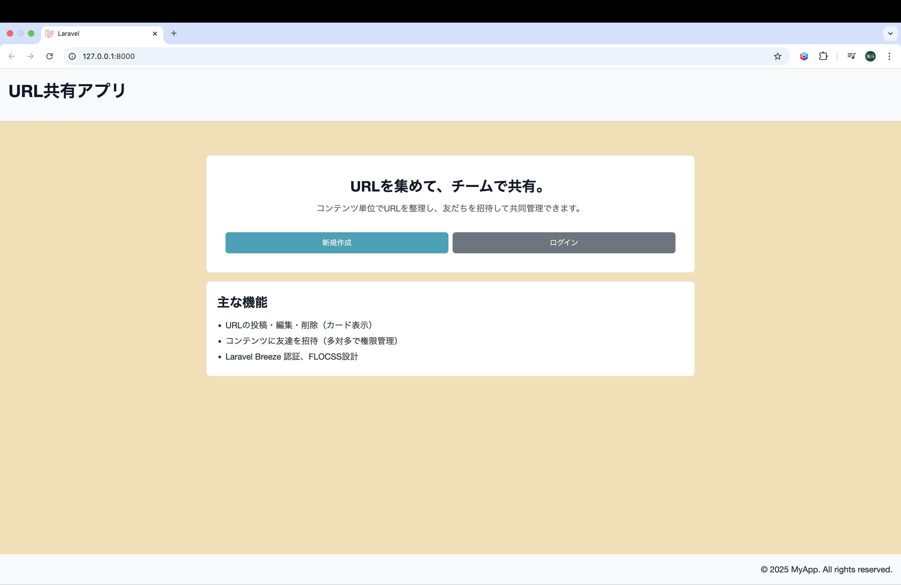
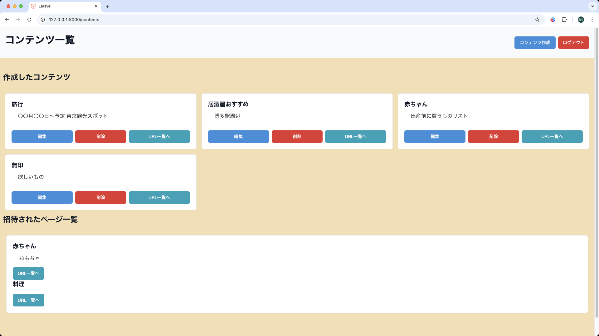
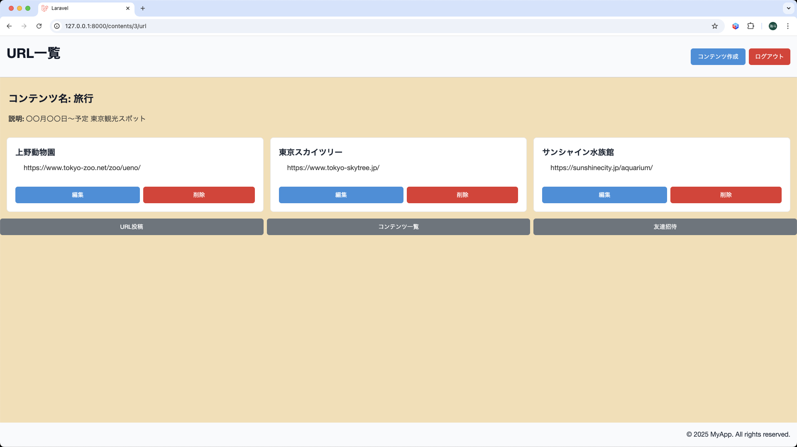
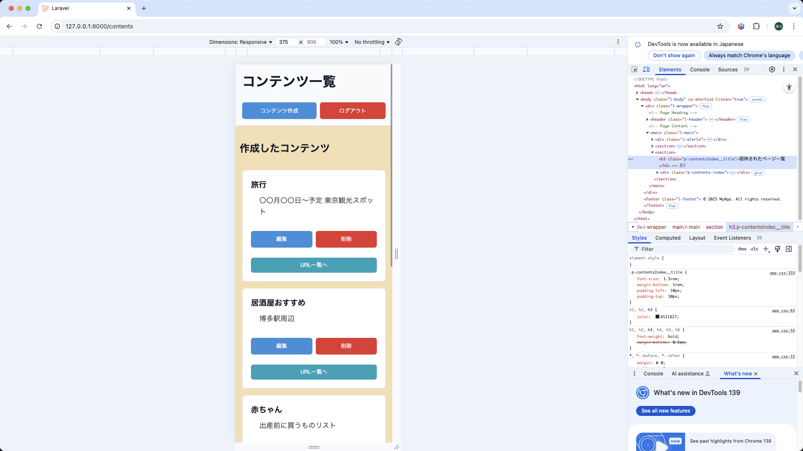

# URL共有アプリ

## はじめに
本リポジトリは、学習の集大成として開発したURL共有アプリです。

Laravel / Blade / Breeze をベースに構築し、CSS設計にはFLOCSSを採用しました。

本アプリは、
「Webアプリをゼロから構築する経験」と
「チーム利用を意識した設計」を目的としています。

---

## コンセプト
- コンテンツ（例: 料理・読書・学習テーマ）ごとに URL を整理
- 友達を招待して、1つの「場」で情報をやり取りできる

---

## アプリの概要
- ユーザー登録・ログイン（Laravel Breeze）
- コンテンツの作成 / 編集 / 削除
- コンテンツにユーザーを招待（多対多）
- コンテンツ内で URL の投稿 / 編集 / 削除
- レスポンシブ対応（スマホ / タブレット / PC）

---

## スクリーンショット

### トップページ（Welcome）


### コンテンツ一覧


### URL一覧（カード型）


### スマホ表示（レスポンシブ対応）


---

## 開発環境
- PHP 8 / Laravel 10
- Blade テンプレート
- CSS: FLOCSS
- 認証: Laravel Breeze
- DB: SQLite（開発環境）
- ビルド: Vite

---

## 起動方法
1. リポジトリを取得
```bash
git clone https://github.com/tk-0422/url.git
cd url
```

2. インストール
```bash
composer install
npm install
```

3. 環境ファイルを設定
```bash
cp .env.example .env
php artisan key:generate
```

4. SQLite データベースを作成
```bash
mkdir -p database
touch database/database.sqlite
```

5. .env を編集（以下を確認）
```bash
DB_CONNECTION=sqlite
DB_DATABASE=database/database.sqlite
```

6. マイグレーション実行
```bash
php artisan migrate
```

7. アプリ起動（別ターミナルでフロントもビルド）
```bash
npm run dev
php artisan serve
```

8. ブラウザでアクセス
http://127.0.0.1:8000

---

## 実装予定の機能
- 投稿検索(タイトル・説明でフィルター)
- プロフィール編集(アイコン/表示名の変更)
- いいね機能(URLに対してリアクションできる)

---

## 終わりに
このアプリの開発を通じて、

- Laravel を使った MVC 設計
- Blade + FLOCSS による UI 実装
- 認証・招待機能や多対多リレーション の設計

といった内容を実践的に経験しました。

今後はさらに機能追加や改善を行い、チーム開発に適した設計を意識して取り組んでいきたいと考えております。
この経験を活かし、実務でも即戦力となれるエンジニアを目指します。
